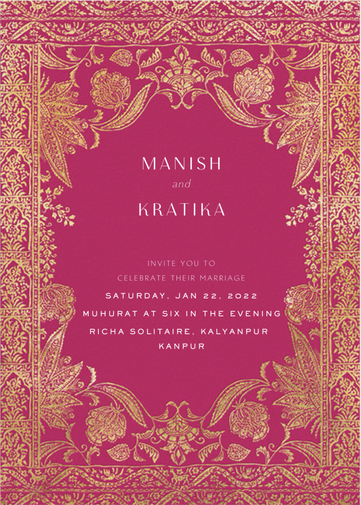

<p align="center"><a href="https://www.sarthakj.me/WeddingEvite/"></a></p>
<h1 align="center"><a href="./assets/coming-soon.pdf">Wedding Invitation</a> :ring: <br> <br> SAVE THE DATE: 22nd Jan, 2022 <br> <a href="https://manishpathak.co.in/">Website</a></h1>


## Wedding Invitation :ring:

<details>
  <summary><strong>View Invitation</strong></summary>
  <a href="https://saharshisha.netlify.app/"></a>
</details>

With the divine grace of the almighty, inviting you and your family to Manish's wedding to be held on **22nd January at [Richa Solitaire](https://g.page/richasolitaire),  Kalyanpur, Kanpur from 6:00 PM** onwards.


```js

const newCouple = 'Manish & Kratika';

// Feb 14, 2021
const weddingDate = new Date(2022, 01, 22);

// Wedding venue: https://g.page/Mishttenresort
const weddingVenue = new Location('Kanpur UP');

(function() {
    newCouple.willTieKnot(weddingDate);

    // your presence is requested
    (new Wedding()).acceptInvitation(
        window.open('https://manishpathak.co.in/')
    );
})();


```
## Are you or your loved ones a *bride-to-be* or *groom-to-be*? 
> Feel free to use this template to build your wedding website!

### Do not forget to leave a star! :hugs:

<br><sup><i>With warm regards,<br>
**Manish Pathak**<i></sup><br>

## Credits for the Project 

* Vinit Shahdeo - GitHub - https://github.com/vinitshahdeo  Project - https://github.com/vinitshahdeo/Wedding-Invitation

* Sanket Singh - GitHub - https://github.com/singhsanket143 LinkedIn - https://www.linkedin.com/in/singhsanket143/ 